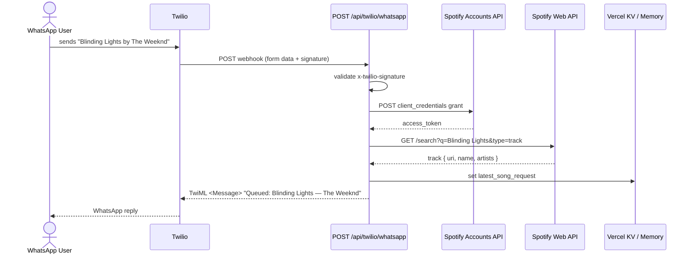
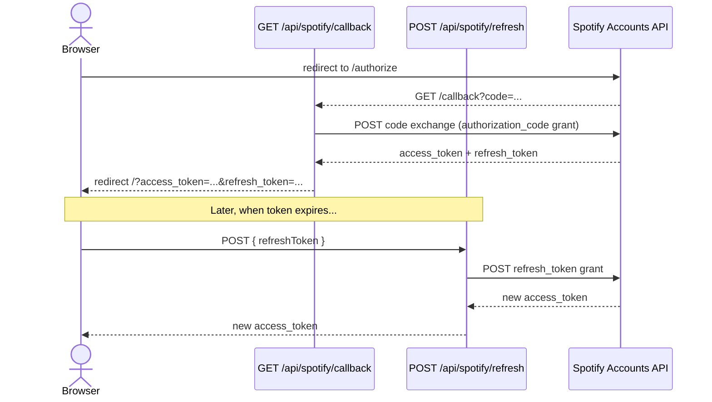
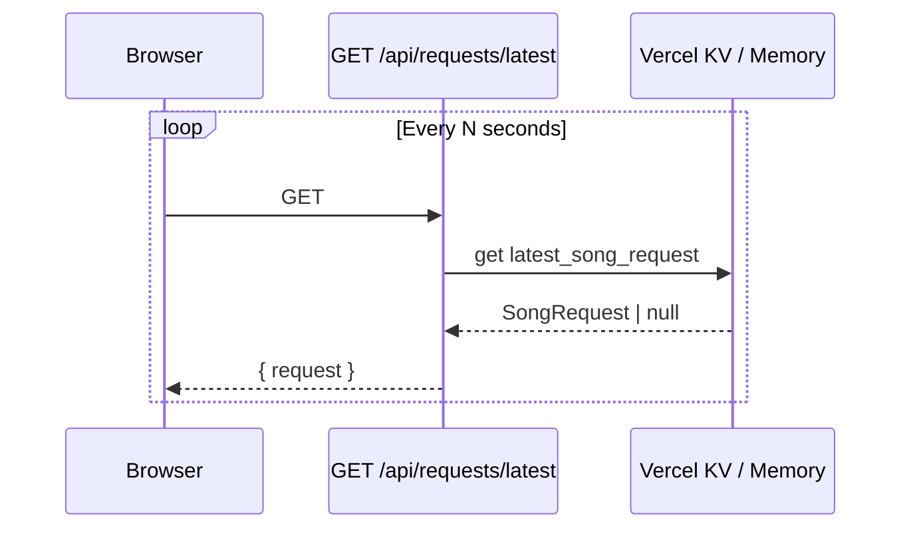

# API Communication Diagram

This document shows how the internal Next.js API routes and external services communicate with each other.

---

## Architecture Overview

```mermaid
flowchart TD
    subgraph Users["Users / Clients"]
        WA["📱 WhatsApp User"]
        Browser["🌐 Browser (Frontend)"]
    end

    subgraph Twilio["Twilio"]
        TW_WA["WhatsApp Webhook"]
    end

    subgraph App["Next.js App (API Routes)"]
        subgraph Twilio_Routes["Twilio Routes"]
            R_WA["POST /api/twilio/whatsapp"]
        end

        subgraph Spotify_Routes["Spotify Routes"]
            R_CB["GET /api/spotify/callback"]
            R_RF["POST /api/spotify/refresh"]
            R_SR["GET /api/spotify/search"]
            R_SA["GET /api/spotify/search-artist"]
            R_AR["GET /api/spotify/artist"]
            R_PC["POST /api/spotify/playlist/create"]
            R_PT["POST /api/spotify/playlist/add-track"]
        end

        subgraph Internal_Routes["Internal Routes"]
            R_RL["GET /api/requests/latest"]
            R_PG["GET /api/playlist/get-active"]
            R_PS["POST /api/playlist/set-active"]
        end

        subgraph Store["lib/songStore"]
            KV["Vercel KV\n(or in-memory fallback)"]
        end
    end

    subgraph Spotify["Spotify"]
        SP_AUTH["Accounts API\naccounts.spotify.com"]
        SP_API["Web API\napi.spotify.com"]
    end

    %% WhatsApp Song Request Flow
    WA -->|"sends song title via WhatsApp"| TW_WA
    TW_WA -->|"POST webhook + x-twilio-signature"| R_WA
    R_WA -->|"client_credentials grant"| SP_AUTH
    SP_AUTH -->|"access_token"| R_WA
    R_WA -->|"GET /search?q=..."| SP_API
    SP_API -->|"track result"| R_WA
    R_WA -->|"store latest request"| KV
    R_WA -->|"TwiML response"| TW_WA
    TW_WA -->|"confirmation message"| WA

    %% OAuth Flow
    Browser -->|"initiates OAuth"| SP_AUTH
    SP_AUTH -->|"GET ?code=..."| R_CB
    R_CB -->|"POST code exchange"| SP_AUTH
    SP_AUTH -->|"access_token + refresh_token"| R_CB
    R_CB -->|"redirect with tokens"| Browser

    %% Token Refresh
    Browser -->|"POST {refreshToken}"| R_RF
    R_RF -->|"POST refresh_token grant"| SP_AUTH
    SP_AUTH -->|"new access_token"| R_RF
    R_RF -->|"new token"| Browser

    %% Track Search
    Browser -->|"GET ?q=..."| R_SR
    R_SR -->|"client_credentials grant"| SP_AUTH
    SP_AUTH -->|"access_token"| R_SR
    R_SR -->|"GET /search?type=track"| SP_API
    SP_API -->|"track"| R_SR
    R_SR -->|"track result"| Browser

    %% Artist Search
    Browser -->|"GET ?q=..."| R_SA
    R_SA -->|"client_credentials grant"| SP_AUTH
    SP_AUTH -->|"access_token"| R_SA
    R_SA -->|"GET /search?type=artist"| SP_API
    SP_API -->|"artist"| R_SA
    R_SA -->|"artistId + name"| Browser

    %% Artist Details
    Browser -->|"GET ?id=&userToken="| R_AR
    R_AR -->|"GET /artists/:id\nGET /artists/:id/albums\nGET /albums/:id/tracks"| SP_API
    SP_API -->|"artist + album + tracks"| R_AR
    R_AR -->|"full artist info"| Browser

    %% Playlist Create
    Browser -->|"POST {accessToken, name}"| R_PC
    R_PC -->|"GET /me"| SP_API
    R_PC -->|"POST /users/:id/playlists"| SP_API
    SP_API -->|"playlist"| R_PC
    R_PC -->|"playlistId + url"| Browser

    %% Playlist Add Track
    Browser -->|"POST {accessToken, playlistId, trackUri}"| R_PT
    R_PT -->|"POST /playlists/:id/tracks"| SP_API
    SP_API -->|"success"| R_PT
    R_PT -->|"success"| Browser

    %% Internal State
    Browser -->|"GET"| R_RL
    R_RL -->|"read latest_song_request"| KV
    KV -->|"SongRequest"| R_RL
    R_RL -->|"latest request"| Browser

    Browser -->|"GET"| R_PG
    R_PG -->|"read active_playlist_id"| KV
    KV -->|"playlistId"| R_PG
    R_PG -->|"playlistId"| Browser

    Browser -->|"POST {playlistId}"| R_PS
    R_PS -->|"write active_playlist_id"| KV
    R_PS -->|"success"| Browser
```

---

## Key Flows (Sequence Diagrams)

### 1. WhatsApp Song Request

### 2. Spotify OAuth + Token Refresh

### 3. Frontend Polls for Latest Song Request

---

## Summary of External API Calls by Route

| Route | External Service | Auth Method |
|---|---|---|
| `POST /api/twilio/whatsapp` | Spotify Accounts API | Client Credentials |
| `POST /api/twilio/whatsapp` | Spotify Web API `/search` | Client token |
| `GET /api/spotify/callback` | Spotify Accounts API | Authorization Code exchange |
| `POST /api/spotify/refresh` | Spotify Accounts API | Refresh Token grant |
| `GET /api/spotify/search` | Spotify Accounts API | Client Credentials |
| `GET /api/spotify/search` | Spotify Web API `/search` | Client token |
| `GET /api/spotify/search-artist` | Spotify Accounts API | Client Credentials |
| `GET /api/spotify/search-artist` | Spotify Web API `/search` | Client token |
| `GET /api/spotify/artist` | Spotify Web API `/artists`, `/albums` | User token |
| `POST /api/spotify/playlist/create` | Spotify Web API `/me`, `/playlists` | User token |
| `POST /api/spotify/playlist/add-track` | Spotify Web API `/playlists/:id/tracks` | User token |
| `GET /api/requests/latest` | Vercel KV _(or in-memory)_ | — |
| `GET /api/playlist/get-active` | Vercel KV _(or in-memory)_ | — |
| `POST /api/playlist/set-active` | Vercel KV _(or in-memory)_ | — |
